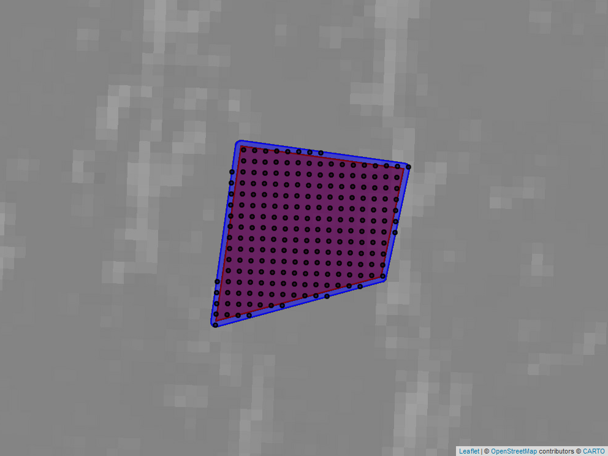
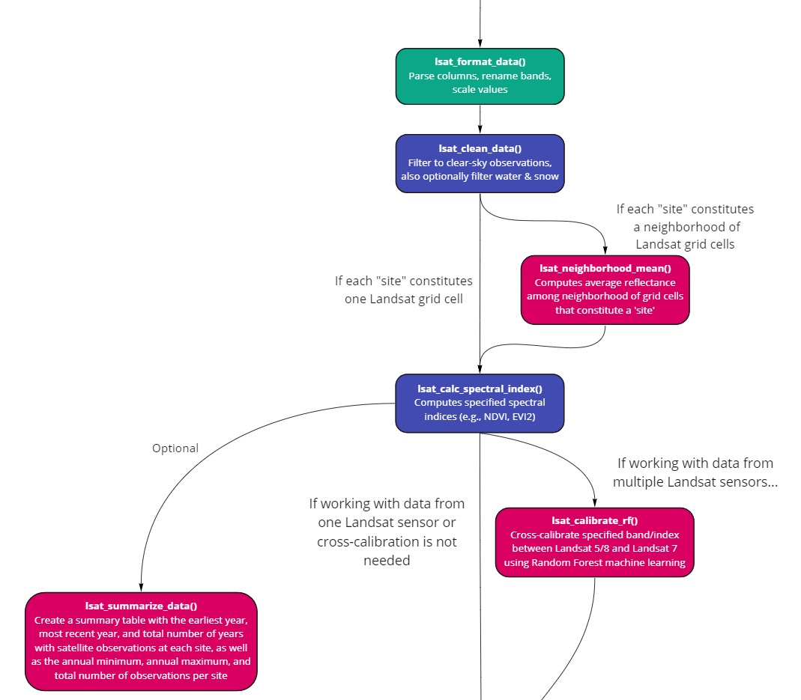

<!-- README.md is generated from README.Rmd. Please edit that file -->

```{r, include = FALSE}
knitr::opts_chunk$set(
  collapse = TRUE,
  comment = "#>",
  fig.path = "man/figures/README-",
  out.width = "100%"
)
```

# lsatTS - an R package to make sense of Landsat greeneness time-series
<!-- badges: start -->
<!-- badges: end -->
**Logan T. Berner, Jakob J. Assmann, Richard Massey, Signe Normand and Scott Goetz**

Building upon the workflow developed for [Berner et al. 2020](https://www.nature.com/articles/s41467-020-18479-5) the **lsatTS** package helps you to:

- Export time-series for the whole Landsat record based on point coordinates ("sites").
- Cross-calibration of Landsat VI time-series to account for sparse observations and sensor differences. 
- The definition of growing season characteristics such as the maximum NDVI.

## Content
1. [Installation](#1-installation)
2. [Preparation and extraction](#2-preparation-and-extraction)
3. [Cross calibration of time-series](#3-cross-calibration-of-time-series)
4. [Defining growing season characteristics](#4-defining-growing-season-characteristics)
5. [Citation](#5-citation)
6. [Contact](#6-contact)
7. [Contributions](#7-contributions)
8. [References](#8-references)
9. [License](#9-license)

## 1. Installation

You can install the package using `devtools` as follows:

``` r
# install.packages("devtools")
devtools::install_github("jakobjassmann/lsatTS")
```

For the preparation and extractions scripts you will also have to make sure you have the `rgee` package installed, fully  configured and the Earth Engine initialized for the current R session. You can find out how to do that on the [rgee website](https://r-spatial.github.io/rgee/).   

[\[to top\]](#content)

## 2. Preparation and extraction

Before you start you will have to determine whether you will extract data for point coordinates or for a polygon area. See flow chart below. 

The time-series extraction from the Google Earth Engine with `lsat_extract_ts()` will __*only*__ work for point coordinates. If you have a polygon you can use `lsat_get_pixel_centres()` to generate point coordinates based on all Landsat 8 pixel centers that fall within your polygon.

This section illustrates how to use the two functions. Please note that while the other sections below will always run well in a non-interactive session some of the optional functionality in this section may require R Studio. This includes for example generating the map views and using the access to the Google Drive via `rgee`. 


**Setting up the environment**

Let's prepare the environment for the extractions:

``` {r eval = FALSE}
# Load packages for data handling etc.
library(sf)
library(dplyr)
library(purrr)
library(data.table)
library(stringr)
library(rgee)

# Load lsatTS package
library(lsatTS)

# Intialize the Earth Engine with rgee
ee_Initialize()

```

**Getting pixel centers using lsat_get_pixel_centers()**

Next, we assume you have no point coordinates ready yet, but would like to extract the Landsat time-series for a polygon. So we start with `lsat_get_pixel_centers()`. This function is a convenience helper function that determines the Landsat 8 grid pixel centers within a polygon (adding an optional buffer). Below are two examples that show how it works. 

*Tip: You can download the WRS2 scene boundaries kml file from USGS and specify it in the function call to avoid downloading it every time the function is called. See `?lsat_get_pixel_centers` for more info.*

**Important:** It is not advisable to determine pixel centers for very large polygons. See `?lsat_get_pixel_centers` for more on this.

**First**, for a single polygon:

``` {r eval = FALSE}
# Specify a region 
test_poly <- st_polygon(
list(matrix(c(-138.90125, 69.58413,
               -138.88988, 69.58358,
               -138.89147, 69.58095,
               -138.90298, 69.57986,
               -138.90125, 69.58413),
             ncol = 2, byrow = T)))
test_poly_sf <- st_sf(st_sfc(test_poly, crs = 4326))

# Use lsat_get_pixel_centers to retrieve pixel centers and plot to a file that can be added to this documentation.
# We set plot_map to T to view 
pixel_list_test_poly <- lsat_get_pixel_centers(test_poly_sf, plot_map = "man/figures/lsat_get_pixel_centers.png")

```
Here is a capture of what you would see in the map view port of R Studio: 



**Second**, for multiple polygons:

``` {r eval = FALSE}

## Ge pixel centers for multiple regions
# Create multi-polygon sf
ellesmere <- st_polygon(list(matrix(c(-75.78526, 78.86973, 
                                      -75.78526, 78.87246,
                                      -75.77116, 78.87246, 
                                      -75.77116, 78.86973, 
                                      -75.78526, 78.86973),
                                      ncol = 2, byrow = T)))
yamal <- st_polygon(list(matrix(c(68.54580, 70.18874, 
                                  68.54580, 70.19145,
                                  68.55379, 70.19145, 
                                  68.55379, 70.18874,
                                  68.54580, 70.18874), 
                                  ncol = 2, byrow = T)))
toolik <- st_polygon(list(matrix(c(-149.60686, 68.62364, 
                                   -149.60686, 68.62644, 
                                   -149.59918, 68.62644, 
                                   -149.59918, 68.62364, 
                                   -149.60686, 68.62364), 
                                   ncol = 2, byrow = T)))
test_regions_sf <- st_sfc(ellesmere, yamal, toolik, crs = 4326) %>% st_sf() %>%
   mutate(region = c("ellesmere", "yamal", "toolik"))

# Split and map lsat_get_pixel_centers using dplyr and purrr wihout plotting
pixel_list <- test_regions_sf %>%
    split(.$region) %>%
    map(lsat_get_pixel_centers,
        pixel_prefix_from = "region") %>%
    bind_rows()
  
# Let's look at the returned sf object:
pixel_list
```

**Exporting time-series from the Earth Engine using lsat_extract_ts()**

Now that we have point coordinates ready we can use `lsat_extract_ts()` to extract the Landsat time-series from the Earth Engine. See the code examples below for how this is done. For this tutorial we only use a small number of points to speed things up a bit.

The `lsat_extract_ts()` function will accept any sf object that contains a point feature collection. It also requires one column with unique identifiers for each "site" (i.e. a pixel identifier) these can be specified with `site_id_from =`. If you have an attribute column called "site_id" such as that generated by `lsat_get_pixel_centers()` you will not have to specify anything extra. 

`lsat_extract_ts()` issues a task to the Earth Engine that exports the data to your Google Drive. The output folder is by default `/lsatTS_export/` you can change the output folder and file name using the relevant arguments (see `?lsat_extract_ts`). 

Importantly to note is that for larger data sets of points the time-series will have to be export in chunks. You can a) let the function chunk the data automatically (no arguments needed), b) set the chunk size (ue `max_chunk_size = `) or c) define the chunks based on a column in the dataset (use `chunks_from = `). Examples for all are shown below. 

**Please note:** There is a reason we decided to export the data in small chunks. For the exports there are two important bottlenecks: 1) transfer of the point data to the Earth Engine and 2) export of time-series from the Earth Engine. The latter is particularly important. Larger chunks are prone to cause more errors and exceed the user limit set on exports by Google. It is safer and perhaps more efficient to issue smaller chunks and bind them back together later rather than exporting one big mass of time-series. We found that 250 points is a happy medium (at time of writing a chunck of that size took about 3h to export). 

``` {r eval = FALSE}
# Generate test points
test_points_sf <- st_sfc(sf::st_point(c(-149.6026, 68.62574)),
                          sf::st_point(c(-149.6003, 68.62524)),
                          sf::st_point(c(-75.78057, 78.87038)),
                          sf::st_point(c(-75.77098, 78.87256)),
                          sf::st_point(c(68.54736, 70.19058)),
                          sf::st_point(c(68.54814, 70.19112)), crs = 4326) %>%
   st_sf() %>%
   mutate(pixel_id = c("toolik_1",
                       "toolik_2",
                       "ellesmere_1",
                       "ellesmere_1",
                       "yamal_1",
                     "yamal_2"),
          region = c("toolik", "toolik",
                     "ellesmere", "ellesmere",
                     "yamal", "yamal"))
 # Export time-series using lsat_export_ts()
 task_list <- lsat_export_ts(test_points_sf)

 ## Further examples:
 # Export time-series using with a chunk size of 2
 # task_list <- lsat_export_ts(test_points_sf, max_chunk_size = 2)

 # Export time-series in chunks by column
 # task_list <- lsat_export_ts(test_points_sf, chunks_from = "region")

```

The function returns the task objects generated by rgee for each chunk to be exported. You can monitor progress of the task using rgee's ee_monitoring() or the GEE WebAPI.

*Tip: Should the export of a chunk fail for some reason you can reissue the export task using the `this_chunk_only =` option. See below.*

``` {r eval = FALSE}
# re-export a chunk
# reexport_task <- lsat_export_ts(test_points_sf, chunks_from = "region", this_chunk_only = "yamal")
```

Once the tasks are completed, open your Google Drive and check the `/lsatTS_export/` folder (or the folder you specified) and retrieve the data to process it in Sections 3 and 4 below. For example, you could use the Google Drive Backup tool or rgee's `ee_drive_to_local()` [function](https://r-spatial.github.io/rgee/reference/ee_drive_to_local.html) to copy the data automatically to a local drive:

``` {r eval = FALSE}
# Monitor export progress, waiting for last export to have finished
map(task_list, ee_monitoring)

# Copy exported file(s) to tempfolder in R using ee_drive_to_local()
temp_files <- map(task_list, ee_drive_to_local)
```

[\[to top\]](#content)

## 3. Cross-calibration of time-series



``` {r eval = FALSE}
# Read in and combine the temp files containing Landsat data 
# (as extracted form the EE above using lsat_export_ts()
lsat.dt <- do.call("rbind", lapply(temp_files, fread))
setnames(lsat.dt, 'pixel_id','site') # all lsatTS function depend on there being a column called "site" that uniquely identifies each location

# Parse data, filter to clear-sky observations, compute mean surface reflectance among pxls w/in each window around a site
lsat.dt <- lsat_general_prep(lsat.dt)

# Clean the data, filtering out clouds, snow, water, radiometric and geometric errors
lsat.dt <- lsat_clean_data(lsat.dt, geom.max = 15, cloud.max = 80, sza.max = 60, filter.snow = T, filter.water = T)

# Optional:
# lsat.dt <- lsat_ngb_mean(lsat.dt)

# Compute NDVI
lsat.dt <- lsat_calc_spec_index(lsat.dt, 'ndvi')

# Cross-calibrate NDVI among sensors using RF models
lsat.dt <- lsat_calibrate_rf(lsat.dt, band = 'ndvi', doy.rng = 151:242, min.obs = 2, frac.train = 0.80, outdir = 'tests/lsat_TS_test_run/ndvi_xcal/')

# Drop column with uncalibrated data and remain column with calibrated data
lsat.dt[, c('ndvi') := NULL]
setnames(lsat.dt, 'ndvi.xcal', 'ndvi')

# Optional: Summarize availability of Landsat data by site
data.summary.dt <- lsat_summarize_data_avail(lsat.dt)
data.summary.dt
```

[\[to top\]](#content)

## 4. Defining growing season characteristics


``` {r eval = FALSE}
# Fit phenological models (cubic splines) to each time series
lsat.pheno.dt <- lsat_fit_phenological_curves(lsat.dt, vi = 'ndvi', window.yrs = 5, window.min.obs = 10, vi.min = 0, spl.fit.outfile = F, progress = T)

# Summarize vegetation index for the "growing season", including estimating annual max vegetation index
lsat.gs.dt <- lsat_summarize_growing_seasons(lsat.pheno.dt, vi = 'ndvi', min.frac.of.max = 0.75)

# Optional: Evaluate
lsat.gs.eval.dt <- lsat_evaluate_phenological_max(lsat.pheno.dt, vi = 'ndvi', min.obs = 10, reps = 10, min.frac.of.max = 0.75)

# Write out data.table with growing season summaries
# fwrite(lsat.gs.dt, 'tests/lsat_TS_test_run/lsat_annual_growing_season_summaries.csv')
```

[\[to top\]](#content)

## 5. Citation 
When using this package please citing:

Berner, Logan T., Richard Massey, Patrick Jantz, Bruce C. Forbes, Marc Macias-Fauria, Isla Myers-Smith, Timo Kumpula, et al. 2020. Summer Warming Explains Widespread but Not Uniform Greening in the Arctic Tundra Biome. Nature Communications 11, no. 1: 4621. [https://doi.org/10.1038/s41467-020-18479-5](https://doi.org/10.1038/s41467-020-18479-5).

[\[to top\]](#content)

## 6. Contact
Logan T. Berner and Jakob J. Assmann

Email Logan at: [Logan.Berner@nau.edu](mailto:Logan.Berner@nau.edu)

Email Jakob at: [j.assmann@bio.au.dk](mailto:j.assmann@bio.au.dk)

[\[to top\]](#content)

## 7. Contributions

Logan T. Berner wrote the analysis functions (Sections 3 and 4). Jakob J. Assmann wrote the extraction and preparation functions (Section 1). Richard Massey wrote the original Python code for the `lsat_export_ts()` function, later refined and transferred to JavaScript and R by Jakob Assmann. Singe Normand and Scoet Goetz provided funding (?) and mentorship for this project. Jakob J. Assmann faciliated package development. Logan T Berner and Jakob J. Assmann prepared the code for publication and wrote the documnetation. 

Thank you to all the testers: Tester A, Tester B and Tester C.

[\[to top\]](#content)

## 8. References

**rgee**

C Aybar, Q Wu, L Bautista, R Yali and A Barja (2020) rgee: An R package for interacting with Google Earth Engine
  Journal of Open Source Software URL https://github.com/r-spatial/rgee/.
  
## 9. License

[MIT LICENSE](LICENSE)

[\[to top\]](#content)

