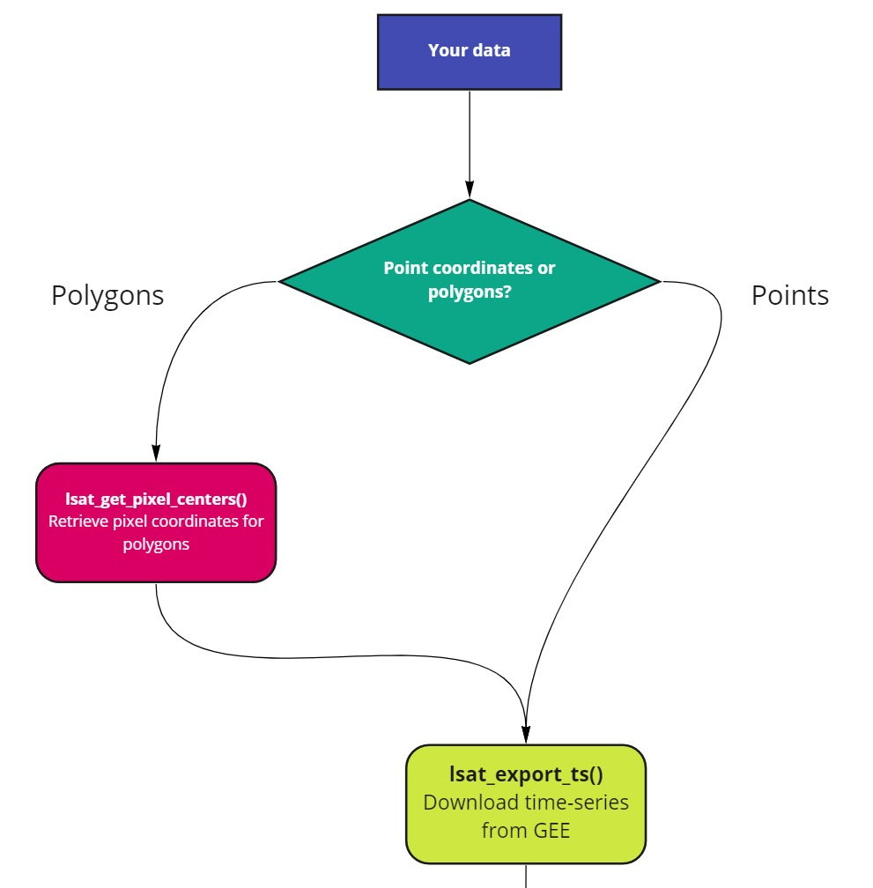
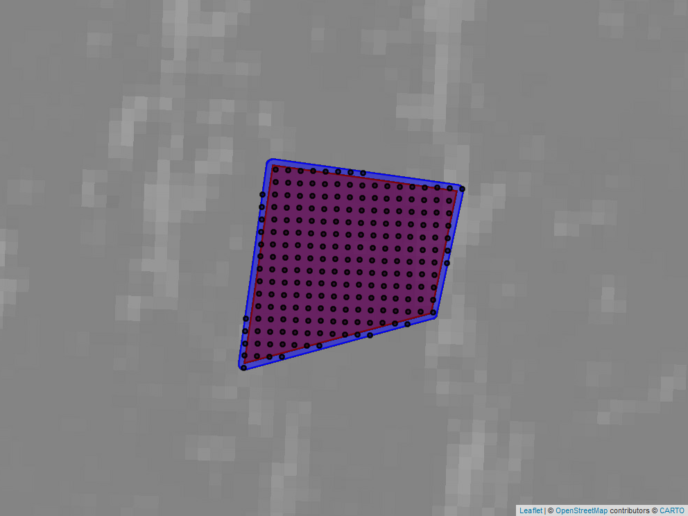
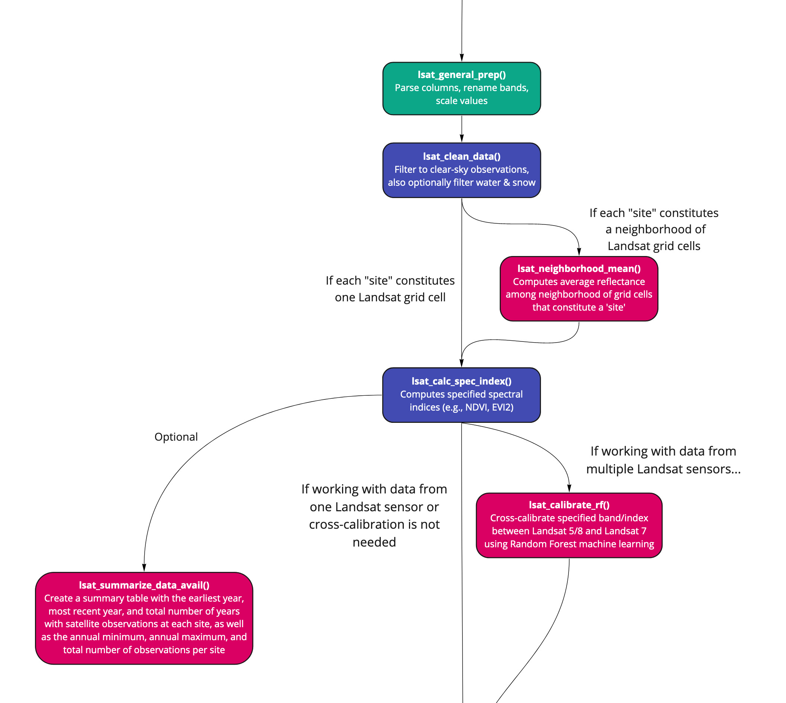
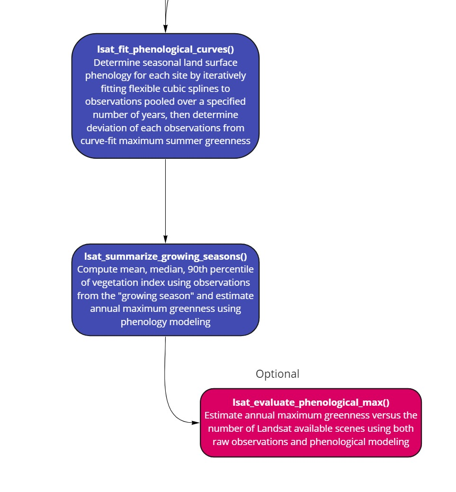

<!-- README.md is generated from README.Rmd. Please edit that file -->

# LandsatTS - an R package for deriving vegetation greenness time series using Landsat satellite data

<!-- badges: start -->
<!-- badges: end -->

**Logan T. Berner, Jakob J. Assmann, Signe Normand and Scott Goetz**

The **LandsatTS** package helps you to:

-   Export whole Landsat record time series based on point coordinates
    (“sites”).
-   Quality screen surface reflectance measurements from Landsat.
-   Cross-calibrate surface reflectance measurements and vegetation
    indices among Landsat sensors.
-   Quantify growing season characteristics using Landsat time series
    (e.g., annual maximum NDVI).

## Content

1.  [Installation](#1-installation)
2.  [Prepare sites and extract Landsat
    data](#2-prepare-sites-and-extract-Landsat-data)
3.  [Clean and cross-calibrate Landsat
    data](#3-clean-and-cross-calibrate-Landsat-data)
4.  [Quantify growing season
    characteristics](#4-quantify-growing-season-characteristics)
5.  [Citation](#5-citation)
6.  [Contact](#6-contact)
7.  [Contributions](#7-contributions)
8.  [References](#8-references)
9.  [License](#9-license)
10. [Funding](#10-funding)

## 1. Installation

You can install the package using `devtools` as follows:

``` r
# install.packages("devtools")
devtools::install_github("logan-berner/LandsatTS")
```

For the preparation and extractions scripts you will also have to make
sure you have the `rgee` package installed, fully configured and the
Earth Engine initialized for the current R session. You can find out how
to do that on the [rgee website](https://r-spatial.github.io/rgee/).

*Tip: All functions are designed to run in a non-interactive R Session.
The only exception is `lsat_get_pixel_centers()`, which optionally
allows the user to view and export a map. For this to work the function
may have to be run in an interactive session in RStudio (not tested
outside) and you may also have to install the external program
PhantomJS. If so, you will be prompted to do so using
`webshot::install_phantomjs()`. You can find out more
[here](https://wch.github.io/webshot/articles/intro.html).*

[$$to top$$](#content)

## 2. Prepare sites and extract Landsat data

Before you start you will have to determine whether you will extract
data for point coordinates or for a polygon area. See flow chart below.

The time-series extraction from the Google Earth Engine with
`lsat_export_ts()` will ***only*** work for point coordinates. If you
have a polygon you can use `lsat_get_pixel_centers()` to generate point
coordinates based on all Landsat 8 pixel centers that fall within your
polygon.

This section illustrates how to use the two functions. Please note that
while the other sections below will always run well in a non-interactive
session some of the optional functionality in this section may require R
Studio. This includes for example generating the map views and using the
access to the Google Drive via `rgee`.



**Setting up the environment**

Let’s prepare the environment for the extractions:

``` r
# Load packages for data handling etc.
library(sf)
library(dplyr)
library(purrr)
library(data.table)
library(stringr)
library(rgee)

# Load LandsatTS package
library(LandsatTS)

# Intialize the Earth Engine with rgee
ee_Initialize()
```

Note: If you have trouble initializing the Earth Engine, please consult
the rgee website or forum. Some `LandsatTS` users have reported that
they need to initialize by specifying their email address and using the
`drive` option: `ee.Initialize(email = "myemail", drive = TRUE)`

**Getting pixel centers using lsat_get_pixel_centers()**

Next, we assume you have no point coordinates ready yet, but would like
to extract the Landsat time-series for a polygon. So we start with
`lsat_get_pixel_centers()`. This function is a convenience helper
function that determines the Landsat 8 grid pixel centers within a
polygon (adding an optional buffer). Below are two examples that show
how it works.

**Important:** It is not advisable to determine pixel centers for very
large polygons. See `?lsat_get_pixel_centers` for more on this.

*Tip: You can download the WRS2 scene boundaries kml file from USGS and
specify it in the function call to avoid downloading it every time the
function is called. See `?lsat_get_pixel_centers` for more info.*

**First**, for a single polygon:

``` r
# Specify a region 
test_poly <- st_polygon(
list(matrix(c(-138.90125, 69.58413,
               -138.88988, 69.58358,
               -138.89147, 69.58095,
               -138.90298, 69.57986,
               -138.90125, 69.58413),
             ncol = 2, byrow = TRUE)))
test_poly_sf <- st_sfc(test_poly, crs = 4326) %>% st_sf()

# Use lsat_get_pixel_centers to retrieve pixel centers and plot to a file that can be added to this documentation.
# We set plot_map to a file path (or just TRUE) to view 
pixel_list_test_poly <- lsat_get_pixel_centers(test_poly_sf, plot_map = "man/figures/lsat_get_pixel_centers.png")
```

Here is a capture of what you would see in the map view port of R
Studio:



**Second**, for multiple polygons:

``` r

## Ge pixel centers for multiple regions
# Create multi-polygon sf
ellesmere <- st_polygon(list(matrix(c(-75.78526, 78.86973, 
                                      -75.78526, 78.87246,
                                      -75.77116, 78.87246, 
                                      -75.77116, 78.86973, 
                                      -75.78526, 78.86973),
                                      ncol = 2, byrow = TRUE)))
zackenberg <- st_polygon(list(matrix(c(-20.56254, 74.47469, 
                                  -20.56254, 74.47740,
                                  -20.55242, 74.47740, 
                                  -20.55242, 74.47469,
                                  -20.56254, 74.47469), 
                                  ncol = 2, byrow = TRUE)))
toolik <- st_polygon(list(matrix(c(-149.60686, 68.62364, 
                                   -149.60686, 68.62644, 
                                   -149.59918, 68.62644, 
                                   -149.59918, 68.62364, 
                                   -149.60686, 68.62364), 
                                   ncol = 2, byrow = TRUE)))
test_regions_sf <- st_sfc(ellesmere, zackenberg, toolik, crs = 4326) %>% st_sf() %>%
   mutate(region = c("ellesmere", "zackenberg", "toolik"))

# Split and map lsat_get_pixel_centers using dplyr and purrr wihout plotting
pixel_list <- test_regions_sf %>%
    split(.$region) %>%
    map(lsat_get_pixel_centers,
        pixel_prefix_from = "region") %>%
    bind_rows()
  
# Let's look at the returned sf object:
pixel_list
```

**Exporting time-series from the Earth Engine using lsat_export_ts()**

Now that we have point coordinates ready we can use `lsat_export_ts()`
to extract the Landsat time-series from the Earth Engine. See the code
examples below for how this is done. For this tutorial we only use a
small number of points to speed things up a bit.

The `lsat_export_ts()` function will accept any sf object that contains
a point feature collection. It also requires one column with unique
identifiers for each “site” (i.e. a pixel identifier) these can be
specified with `site_id_from =`. If you have an attribute column called
“site_id” such as that generated by `lsat_get_pixel_centers()` you will
not have to specify anything extra.

`lsat_export_ts()` issues one or more tasks to the Earth Engine that
export the data to your Google Drive. The default output folder is
`/lsatTS_export/` you can change the output folder and file name using
the relevant arguments (see `?lsat_export_ts`).

Importantly to note is that for larger data sets of points the
time-series will have to be export in chunks. You can a) let the
function chunk the data automatically (no arguments needed), b) set the
chunk size (ue `max_chunk_size =`) or c) define the chunks based on a
column in the dataset (use `chunks_from =`). Examples for all are shown
below.

**Please note:** There is a reason we decided to export the data in
small chunks. For the exports there are two important bottlenecks: 1)
transfer of the point data to the Earth Engine and 2) export of
time-series from the Earth Engine. The latter is particularly important.
Larger chunks are prone to cause more errors and exceed the user limit
set on exports by Google. It is safer and perhaps more efficient to
issue smaller chunks and bind them back together later rather than
exporting one big mass of time-series. We found that 250 points is a
happy medium (at time of writing a chunck of that size took about 3h to
export).

``` r
# Generate test points
test_points_sf <- st_sfc(sf::st_point(c(-149.6026, 68.62574)),
                          sf::st_point(c(-149.6003, 68.62524)),
                          sf::st_point(c(-75.78057, 78.87038)),
                          sf::st_point(c(-75.77098, 78.87256)),
                          sf::st_point(c(-20.56182, 74.47670)),
                          sf::st_point(c(-20.55376, 74.47749)), crs = 4326) %>%
   st_sf() %>%
   mutate(sample_id = c("toolik_1",
                       "toolik_2",
                       "ellesmere_1",
                       "ellesmere_1",
                       "zackenberg_1",
                     "zackenberg_2"),
          region = c("toolik", "toolik",
                     "ellesmere", "ellesmere",
                     "zackenberg", "zackenberg"))
 # Export time-series using lsat_export_ts()
 task_list <- lsat_export_ts(test_points_sf)

 ## Further examples:
 # Export time-series using with a chunk size of 2
 # task_list <- lsat_export_ts(test_points_sf, max_chunk_size = 2)

 # Export time-series in chunks by column
 # task_list <- lsat_export_ts(test_points_sf, chunks_from = "region")
```

The function returns the task objects generated by rgee for each chunk
to be exported. You can monitor progress of the task using rgee’s
ee_monitoring() or the GEE WebAPI.

*Tip: Should the export of a chunk fail for some reason you can reissue
the export task using the `this_chunk_only =` option. See below.*

``` r
# re-export a chunk
# reexport_task <- lsat_export_ts(test_points_sf, chunks_from = "region", this_chunk_only = "yamal")
```

Once the tasks are completed, open your Google Drive and check the
`/lsatTS_export/` folder (or the folder you specified) and retrieve the
data to process it in Sections 3 and 4 below. For example, you could use
the Google Drive Backup tool or rgee’s `ee_drive_to_local()`
[function](https://r-spatial.github.io/rgee/reference/ee_drive_to_local.html)
to copy the data automatically to a local drive:

``` r
# Monitor export progress, waiting for last export to have finished
map(task_list, ee_monitoring)

# Copy exported file(s) to tempfolder in R using ee_drive_to_local()
temp_files <- map(task_list, ee_drive_to_local)
```

[$$to top$$](#content)

## 3. Clean and cross-calibrate Landsat data

 **Prepare the exported
Landsat data for analysis using lsat_format_data()**

After exporting Landsat data from Earth Engine, it is then necessary
prepare the data for analysis. First, read the exported data into R
using `data.table::fread()` and then use the `lsat_format_data()`
function to parse necessary information, rename columns, and scale band
values.

*Please note:* All LandsatTS functions depend on there being a column
called “sample.id” that uniquely identifies each location. If this
column is not called ‘sample.id’ in your dataset, then make sure to
modify your column name accordingly.

``` r
lsat.dt <- do.call("rbind", lapply(files_exported_from_EE, fread))

# setnames(lsat.dt, 'my_unique_location_column','sample.id') 

lsat.dt <- lsat_format_data(lsat.dt)
```

**Clean the surface reflectance data using lsat_clean_data()**

For most analyses you’ll want to use high-quality surface reflectance
measurements that were acquired under clear-sky conditions. You can
filter surface reflectance measurements using `lsat_clean_data()`. This
function allows you to filter measurements based on pixel quality flags
and scene criteria. The USGS provides pixel quality flags based on the
CFMask algorithm and provides information on each scene (e.g., cloud
cover). The default settings from `lsat_clean_data()` will filter out
snow and water. Addition water masking is provided based on the maximum
surface water extent variable from the JRC Global Surface Water Dataset
that was derived from Landsat.

``` r
lsat.dt <- lsat_clean_data(lsat.dt, geom.max = 15, cloud.max = 80, sza.max = 60, filter.cfmask.snow = T, filter.cfmask.water = T, filter.jrc.water = T)
```

**Optional: Compute average surface reflectance among neighboring pixels
using lsat_neighborhood_mean()**

If each of your sites is actually a neightborhood of Landsat pixels
(e.g., 3 x 3 pixels), then `lsat_neighborhood_mean()` will compute the
mean reflectance across this neighborhood of pixels.

``` r
lsat.dt <- lsat_neighborhood_mean(lsat.dt)
```

**Optional: Summarize the availability of Landsat data for each site
using lsat_summarize_data_avail()**

The function `lsat_summarize_data_avail()` creates a summary table that
provides information on the time period of observations and number of
observations available for each site. It also generates a figure showing
the density of observations across years, which combines data across all
sites.

``` r
data.summary.dt <- lsat_summarize_data_avail(lsat.dt)
data.summary.dt
```

**Calculate spectral indices using lsat_calc_spec_index()**

The function `lsat_calc_spec_index()` allows users to easily calculate
some widely used spectral indices. These include NDVI, EVI, and
currently nine other spectral indices (EVI2, kNDVI, MSI, NBR, NIRv,
NDII, NDWI, PSRI, SATVI). Note that only one index can be computed at a
time.

``` r
# Compute NDVI or other vegetation index
lsat.dt <- lsat_calc_spec_index(lsat.dt, si = 'ndvi')
```

**Cross-calibrate spectral reflectance or index using
lsat_calibrate_rf()**

There are systematic differences in surface reflectance and spectral
indices among Landsat sensors. If you are working with data from
multiple sensors, then it is very important to further cross-calibrate
data among sensors. The function `lsat_calibrate_rf()` will calibrate
individual bands or spectral indices from Landsat 5/8 to match Landsat
7. Landsat 7 is used as a benchmark because it temporally overlaps with
the other two sensors. Cross-calibration can only be performed on one
band or spectral index at a time and requires having data from 100s to
preferably many 1,000s of sample sites. The approach involves
determining the typical reflectance at a site during a portion of the
growing season using Landsat 7 and Landsat 5/8 data that were collected
the same years. A Random Forest model is then trained to predict Landsat
7 reflectance from Landsat 5/8 reflectance. If your data include both
Landsat 5 and 8, then the function will train a Random Forest model for
each sensor. Please note that for analyses focused on Arctic or boreal
regions, there in an option to train the Random Forest models use an
internal dataset of reflectance measurements from \~6,000 random sample
sites. This is accomplished by setting train.with.highlat.data = T. By
default, `lsat_calibrate_rf()` will add a new column with the
cross-calibrated data (\[band\].xcal); however, the function will
overwrite the existing column if you set the option overwrite.col = T
(as used in the example below). The function will optionally also create
an output directory that contains (1) trained Random Forest models, (2)
a spreadsheet with model evaluation metrics, and (3) a multi-panel
figure comparing sensors pre- and post-calibration.

*Note: If you use the default setting that adds a new column with the
cross-calibrated data, then you’ll either want to use those data in the
subsequent functions (e.g., ndvi.xcal) or, once satisfied, manually
overwrite the uncalibrated data to simplify subsuquent column names.*

``` r
# Cross-calibrate NDVI among sensors using an approach based on Random Forest machine learning
lsat.dt <- lsat_calibrate_rf(lsat.dt, band.or.si = 'ndvi', doy.rng = 151:242, min.obs = 5, frac.train = 0.75, overwrite.col = T, write.output = F)

# If needed, then manually overwrite the uncalibrated data with the calibrated data, then drop the duplicate column 
# lsat.dt <- lsat.dt[, ndvi := ndvi.xcal]
# lsat.dt <- lsat.dt[, ndvi.xcal := NULL)
```

[$$to top$$](#content)

## 4. Quantify growing season characteristics



**Fit phenological curves to vegetation greenness time series using
lsat_fit_phenological_curves()**

The function `lsat_fit_phenological_curves()` characterizes seasonal
land surface phenology at each sampling site using vegetation greenness
(e.g., NDVI) time series from Landsat satellite observations. The
function was construted as a stepping stone to estimating annual maximum
vegetation greenness (e.g., NDVImax). The function iteratively fits
cubic splines to seasonal vegetation greenness time series and returns
information about the timing and magnitude of individual vegetation
greenness observation relative to a multi-year seasonal phenology at
each site.

*Note: The function was designed for spectral indices that are typically
positive (e.g., NDVI). If you are working with a spectral index that is
typically negative (e.g., NDWI) then multiply your index by -1 before
running the `lsat_fit_phenological_curves()` and
`lsat_summarize_growing_seasons()` functions and backtransform
afterwards.*

``` r
# Fit phenological models (cubic splines) to each time series
lsat.pheno.dt <- lsat_fit_phenological_curves(lsat.dt, si = 'ndvi', window.yrs = 5, window.min.obs = 10, vi.min = 0, spl.fit.outfile = F, progress = T)
```

**Derived annual growing season metrics using
lsat_summarize_growing_seasons()**

The function `lsat_summarize_growing_seasons()` estimates several annual
growing season metrics from vegetation greenness time series derived
from Landsat satellite observations. The metrics include annual mean,
median, and 90th percentile vegetation greenness of observations during
each growing season, as well as phenologically-modeled estimates of
annual maximum vegetation greenness and the seasonal timing (Day of
Year) of maximum vegetation greenness. This function relies on output
from `lsat_fit_phenological_curves()`.

``` r
lsat.gs.dt <- lsat_summarize_growing_seasons(lsat.pheno.dt, si = 'ndvi', min.frac.of.max = 0.75)
```

**Optional: Evaluate how raw and modeled estimates of annual max NDVI
vary with scene availability using lsat_evaluate_phenological_max()**

Estimates of annual maximum vegetation greenness are sensitive to the
number of observations available from a growing season. The function
`lsat_evaluate_phenological_max()` is a tool for assessing how the
number of annual Landsat observations impacts estimates of annual
maximum vegetation greenness derived from raw observations and after
phenological modeling. The algorithm computes a “true” annual maximum
vegetation greenness using site x years with a user-specific number of
observations and then compares these with estimates derived when using
progressively smaller subsets of observations. This lets you determine
the degree to which annual estimates of maximum vegetation greenness are
impacted by the number of available observations.

``` r
lsat.gs.eval.dt <- lsat_evaluate_phenological_max(lsat.pheno.dt, si = 'ndvi', min.obs = 10, reps = 5, min.frac.of.max = 0.75, outdir = NA)
```

**Compute trends in annual vegetation greenness using
lsat_calc_trend()**

Th function `lsat_calc_trend()` computes a temporal trend in annual time
series of vegetation greenness for each sampling site over a
user-specificed time period. This is a wrapper for the zyp.yuepilon()
function from the zyp package. This function will iteratively pre-whiten
a time series (i.e., remove temporal autocorrelation) and then compute
Mann-Kendall trend tests and Theil-Sen slope indicators.

``` r
lsat.trnds.dt <- lsat_calc_trend(lsat.gs.dt, si = 'ndvi.max', 2000:2020, sig = 0.1)
```

[$$to top$$](#content)

## 5. Citation

When using this package please cite:

Logan T. Berner, Jakob J. Assmann, Richard Massey, Signe Normand and
Scott J. Goetz. 2021. LandsatTS - an R package for deriving vegetation
greenness time series using Landsat satellite data.
<https://github.com/logan-berner/LandsatTS>.

Also please consider citing the peer-reviewed publication for which much
of this code was developed:

Berner, L.T., et al. 2020. Summer Warming Explains Widespread but Not
Uniform Greening in the Arctic Tundra Biome. Nature Communications 11,
no. 1: 4621. <https://doi.org/10.1038/s41467-020-18479-5>.

[$$to top$$](#content)

## 6. Contact

Logan T. Berner and Jakob J. Assmann

Email Logan at: <Logan.Berner@nau.edu>

Email Jakob at: <j.assmann@bio.au.dk>

[$$to top$$](#content)

## 7. Contributions

Logan T. Berner wrote the analysis functions (Sections 3 and 4). Jakob
J. Assmann facilitated package development and wrote the extraction and
preparation functions (Section 2). Richard Massey wrote the original
Python code for the `lsat_export_ts()` function, later refined and
translated first to JavaScript and then rgee code by Jakob J. Assmann.
Singe Normand and Scott Goetz provided funding and mentorship for this
project. Logan T. Berner and Jakob J. Assmann prepared the code for
publication and wrote the documentation.

Thank you to all the testers: Jeff Kerby, Adrianna Foster, Sarah
Elmendorf, Russell Wong, and others!

[$$to top$$](#content)

## 8. References

**rgee**

Aybar C, Wu Q, Bautista L, Yali R and Barja A (2020) rgee: An R package
for interacting with Google Earth Engine, Journal of Open Source
Software, <https://github.com/r-spatial/rgee/>.

**Peer-reviewed publications that have used `LandsatTS` functions:**

1)  Berner, L.T., Massey, R., Jantz, P., Forbes, B.C., Macias-Fauria,
    M., Myers-Smith, I.H., Kumpula, T., Gauthier, G., Andreu-Hayles, L.,
    Gaglioti, B., Burns, P.J., Zetterberg, P., D’Arrigo, R., Goetz,
    S.J., 2020. Summer warming explains widespread but not uniform
    greening in the Arctic tundra biome. Nature Communications 11, 4621.

2)  Berner, L.T., Goetz, S.J., 2022. Satellite observations document
    trends consistent with a boreal forest biome shift. Global Change
    Biology 00, 1-18.

3)  Boyd, M.A., Berner, L.T., Doak, P., Goetz, S.J., Rogers, B.M.,
    Wagner, D., Walker, X.J., Mack, M.C., 2019. Impacts of climate and
    insect herbivory on productivity and physiology of trembling aspen
    (Populus tremuloides) in Alaskan boreal forests. Environmental
    Research Letters 14, 085010.

4)  Boyd, M.A., Berner, L.T., Foster, A.C., Goetz, S.J., Rogers, B.M.,
    Walker, X.J., Mack, M.C., 2021. Historic declines in growth portend
    trembling aspen death during a contemporary leaf miner outbreak in
    Alaska. Ecosphere 12, e03569.

5)  Gaglioti, B., Berner, L.T., Jones, B.M., Orndahl, K.M., Williams,
    A.P., Andreu‐Hayles, L., D’Arrigo, R., Goetz, S.J., Mann,
    D.H., 2021. Tussocks enduring or shrubs greening: Alternate
    responses to changing fire regimes in the Noatak River Valley,
    Alaska. Journal of Geophysical Research: Biogeosciences 126,
    e2020JG006009.

6)  Mekonnen, Z.A., Riley, W.J., Berner, L.T., Bouskill, N.J., Torn,
    M.S., Iwahana, G., Breen, A.L., Myers-Smith, I.H., Criado, M.G.,
    Liu, Y., Euskirchen, E.S., Goetz, S.J., Mack, M.C., Grant,
    R.F., 2021. Arctic tundra shrubification: a review of mechanisms and
    impacts on ecosystem carbon balance. Environmental Research Letters
    16, 053001.

7)  Verdonen, M., Berner, L.T., Forbes, B.C., Kumpula, T., 2020.
    Periglacial vegetation dynamics in Arctic Russia: decadal analysis
    of tundra regeneration on landslides with time series satellite
    imagery. Environmental Research Letters 15, 105020.

8)  Walker, X.J., Alexander, H.D., Berner, L.T., Boyd, M.A., Loranty,
    M.M., Natali, S.M., Mack, M.C., 2021. Positive response of tree
    productivity to warming is reversed by increased tree density at the
    Arctic tundra-taiga ecotone. Canadian Journal of Forest Research 51,
    1323-1338.

## 9. License

[MIT LICENSE](LICENSE)

[$$to top$$](#content)

## 10. Funding

Software development was supported by the National Aeronautics and Space
Administration (NASA) Arctic Boreal Vulnerability Experiment (Grant
No. 80NSSC19M0112) and NASA New Investigator Program (Grant
No. 80NSSC21K1364). Further support was provided by the National Science
Foundation Navigating the New Arctic Big Idea (Grant No. 2127273), the
Independent Research Fund of Denmark (Grant No. 7027-00133B), and the EU
Horizon 2020 CHARTER project (Grant No. 869471).
